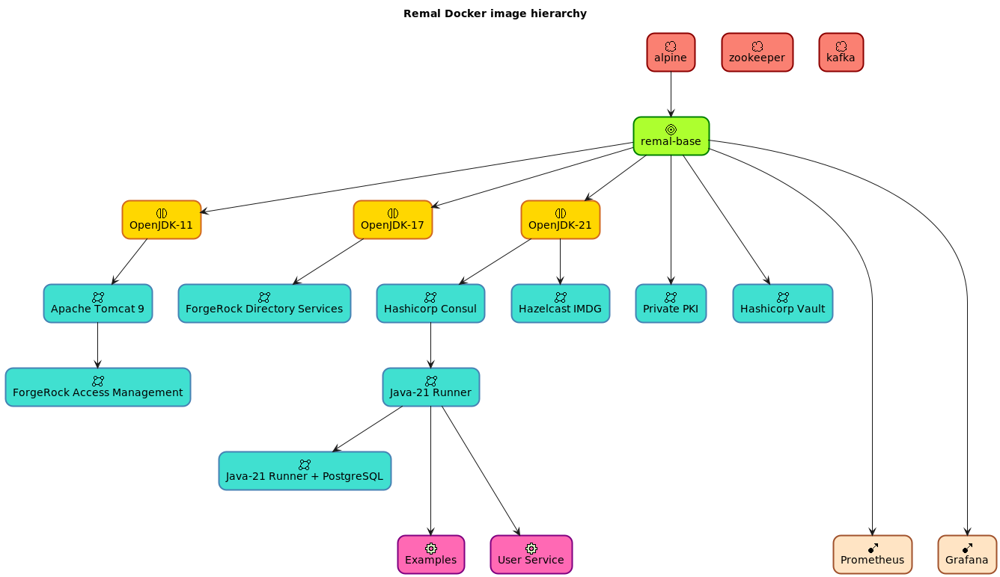

# Remal Gombi

## 1) Overview
This is an integrated development framework running in Docker containers. The containers can be used in `production` environments as well.

Gombi provides the following services:
- _Private Certificate Authority infrastructure (PKI)_
- _LDAP Directory Service_
- _Access Management infrastructure_: authentication, authorization, OAUTH2, etc.
- _Distributed key/value store_: identity-based secret and encryption management system to store key/values with Hashicorp Vault
- _Distributed event streaming platform_: high-performance data pipelines, streaming analytics and data integration with Kafka
- _A powerful open-source distributed and scalable in-memory data cache_
- _Data Analytics & Visualization platforms_: to search, analyze and visualize the machine-generated data and events gathered from the applications, sensors, devices etc.
- _Java 11, 17 and 21 containers as a service (CaaS)_: run Spring Boot applications/microservices

## 2) Docker Images
* Base Image:
  * [Remal Base](docker/base/base): based on Alpine

* Java JDK Images:
  * [OpenJDK-11](docker/core/openjdk-11)
  * [OpenJDK-17](docker/core/openjdk-17)
  * [OpenJDK-21](docker/core/openjdk-21)

* Private Certificate Authority Server (PKI):
  * [OpenVPN/Easy-RSA](docker/infrastructure/easy-rsa-pki): complete Private Certificate Authority Server to manage the server certificates

* Access Management platform: 
  * [ForgeRock Access Management platform](docker/infrastructure/forgerock-am): Authentication, Authorization, OAUTH, SSO, Federation, etc.
  * [ForgeRock Directory Service](docker/infrastructure/forgerock-ds): LDAP server

* Distributed Service Registry and key/value store:
  * [Hashicorp Consul](docker/infrastructure/hcp-consul): Service Registry and Discovery + distributed key/value store
  * [Hashicorp Vault](docker/infrastructure/hcp-vault): key/value store

* Jave Web Container Images
  * [Apache Tomcat 9](docker/infrastructure/tomcat-9)

* Monitoring, analytics and interactive visualization:
  * [Prometheus](docker/monitoring/prometheus): event monitoring, collecting and alerting, it records metrics in a time series database
  * [Grafana](docker/monitoring/grafana): analytics and interactive visualization web application with charts, graphs, and alerts

* Java runners
  * [OpenJDK-21 Runner](docker/application/java-21-runner)
  * [OpenJDK-21 Runner with Postgres Database Server](docker/application/java-21-postgres-runner)

## 3) Build and start
### 3.1) Build the Docker images
1. Start a `Tomcat`.
2. Download the installation files from [here](https://drive.google.com/drive/u/0/folders/1RUkp1vwSX0aTdlQ2zgyOUKQexHovHY77) and copy them under the `$TOMCAT_HOME/webapps/docker-build/` directory.
3. Use the `./update-binaries.sh 1` command to copy the installation files into the image build directories.
4. Build the Docker images using the `./gombi.sh abcdeu` command.

### 3.2) Build the Java projects
    ~~~
    $ cd gombi/projects
    $ mvn clean package 
    ~~~

## 3.3) Start the sample docker stack
    ~~~
    $ cd gombi/projects
    $ ./gombi.sh i1
    ~~~

## 4) Contributions welcome
Please help to improve this project. You can open a bug report, or send a new pull request,
Thanks.

## 5) Thank you for buying me a coffee

|                                                                                                                                                         |
|:-------------------------------------------------------------------------------------------------------------------------------------------------------:|
|                                  **Wise, EUR/USD**                                       |
| [**PayPal, EUR**](https://www.paypal.com/donate/?hosted_button_id=VT6RPK363U5CA)      |
| [**PayPal, USD**](https://www.paypal.com/donate/?hosted_button_id=U5JFBSZ23YGP4)      |

## 6) License and Copyright
Copyright (c) 2020-2025 Remal Software, Arnold Somogyi. All rights reserved.

## Appendix 1) Reference Dockerfile
* Reference Dockerfile: [docker/docker-compose-reference.yml](docker/docker-compose-reference.yml) file.
* For more details, check [this](docker/README.md).

