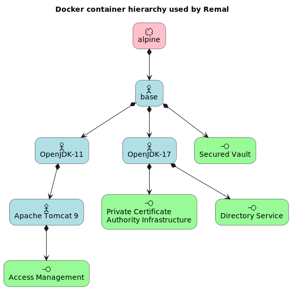

# Remal Gombi

## 1) Overview
This is an integrated development framework running in Docker containers.
The environment provides the following services:
- **Private Certificate Authority infrastructure**: PKI
- **Directory Service**: LDAP
- **Access Management infrastructure**: authentication, authorization, OAUTH2, etc.
- **Vault Service**: identity-based secret and encryption management system to store key/values
- **Distributed event streaming platform**: high-performance data pipelines, streaming analytics and data integration
- A software **platform to search, analyze and visualize the machine-generated data** and events gathered from the websites, applications, sensors, devices etc.

The framework provides the following base Docker images:
- OpenJDK 11 and 17 base Docker images
- Apache Tomcat 9 base image

## 2) Components of the environment
* Base Docker Images:
  * [Remal Base](docker/base/base)
  * [OpenJDK-11](docker/core/openjdk-11)
  * [OpenJDK-17](docker/core/openjdk-17)
  * [Apache Tomcat 9](docker/infrastructure/tomcat-9)
* Service Docker Images:
  * Private Certificate Authority (CA) Infrastructure: [OpenVPN easy-rsa (simple shell based CA utility)](docker/infrastructure/easy-rsa-pki)
  * Vault Service: [HashiCorp Vault](docker/infrastructure/hcp-vault)
  * Directory Service (LDAP): [ForgeRock Directory Server](docker/infrastructure/forgerock-ds)
  * Access Management (authentication, authorization): [ForgeRock Access Management](docker/infrastructure/forgerock-am)

## 3) Deployment 
For more details, check [this](docker/README.md).

## 4) Demo Web application

## 5) License and Copyright
Copyright (c) 2020-2023 Remal Software, Arnold Somogyi. All rights reserved.

