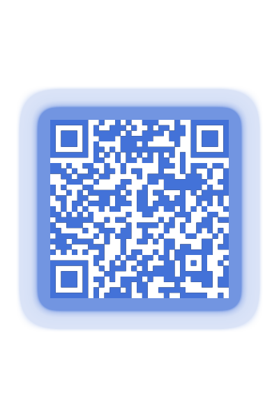

# Remal Gombi Platform

## 1) Overview
The Remal-Gombi is an open source development platform that provides a ready for use development environment fits best for Spring Boot development and supports Java 23.

The Gombi Platform that developers use to build applications can also be used in a production environment without modification. It is fully horizontally scalable, uses secure communication channels between the building boxes and provides a full Private Certificate Authority server to issue, renew and revoke server certificates signed by the organisation's root CA.

It also supports advanced real-time monitoring capabilities with time and counter-based metrics that can be used by the operations team or managers to measure/present SLAs. Fully customisable charts can easily show the frequency of service calls (e.g. REST endpoints) or the serving time of requests for any service in the Platform.

The services provided by the Gombi Platform support rapid development for start-ups, small and medium-sized companies. With the Gombi Platform, IT teams can quickly deliver the IT solutions what the business needs, and later, as the business evolves, the services and building blocks can be easily improved and replaced with zero downtime.

The platform is best suited for building microservices with Java and Spring Boot.

**The Platform offers**
* Java Runtime Environment with pre-configured Docker containers with Java 11, 17, 21 and 23

* Java runtime environments containers with embedded database server supporting the Database per Service design pattern

* Platform-wide Private Certificate Authority (PKI) server

* Distributed Service Registry with codeless, automated service registration

* A distributed Key-Value store supporting centralised application configuration management and real-time service configuration

* Distributed cache service through three different topologies as embedded cache, client-server cache and near-cache

* Stream processing and event handling with Kafka

* High performance distributed LDAP server

* Open source Access Management solution supporting authentication and authorisation such as OAUTH, SSO, federation, self-registration via Google, Facebook, Twitter, Github, etc.

* Collect and view events that occur across the Gombi Platform, such as user clicks, service call details, user request response times.

* Kafka topic message streams monitoring.

## 2) Tutorial
* [Link to the tutorial video](https://drive.google.com/drive/folders/1ZHCeUBk9DjFfe5kVyQJyuRHimpODr5Cf?usp=sharing)

## 3) Docker Image Hierarchy

## 4) Build and start
### 4.1) Build the Docker images
1. Start a `Tomcat`.
2. Download the installation files from [here](https://drive.google.com/drive/u/0/folders/1RUkp1vwSX0aTdlQ2zgyOUKQexHovHY77) and copy them under the `$TOMCAT_HOME/webapps/docker-build/` directory.
3. Use the `./update-binaries.sh 1` command to copy the installation files into the image build directories.
4. Build the Docker images using the `./gombi.sh abcdeu` command.

### 4.2) Build the Java projects
    ~~~
    $ cd gombi/projects
    $ mvn clean package 
    ~~~

### 4.3) Start the sample docker stack
    ~~~
    $ cd gombi/projects
    $ ./gombi.sh i1
    ~~~

## 5) Contributions welcome
Please help to improve this project.

You can open a bug report or submit a new pull request with new features, fixes or improvements.

## 6) Thank you for buying me a coffee
* **Wise, EUR/USD**:

   

* [**PayPal, EUR**](https://www.paypal.com/donate/?hosted_button_id=VT6RPK363U5CA):

  

* [**PayPal, USD**](https://www.paypal.com/donate/?hosted_button_id=U5JFBSZ23YGP4):

  

## 7) License and Copyright
Copyright (c) 2020-2025 Remal Software, Arnold Somogyi. All rights reserved.

