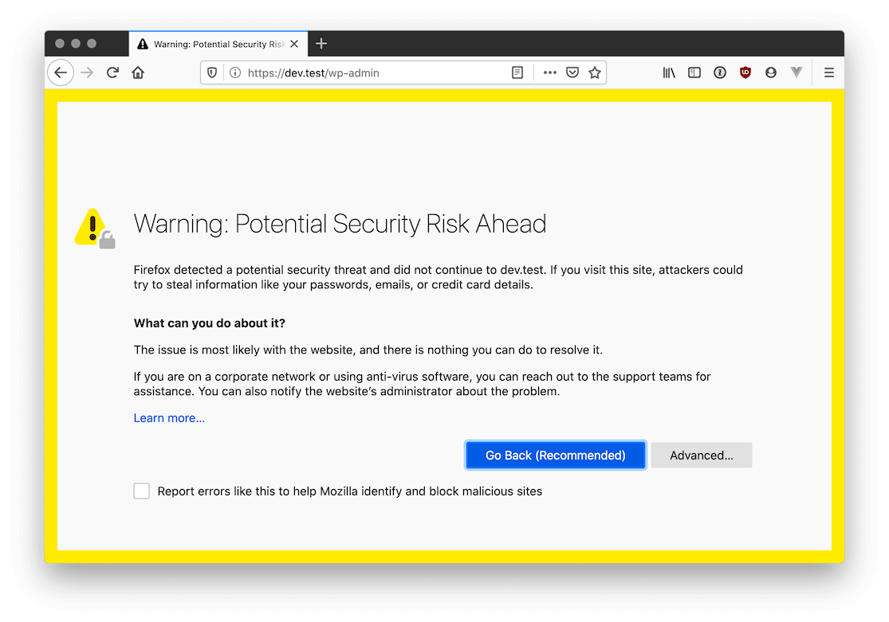
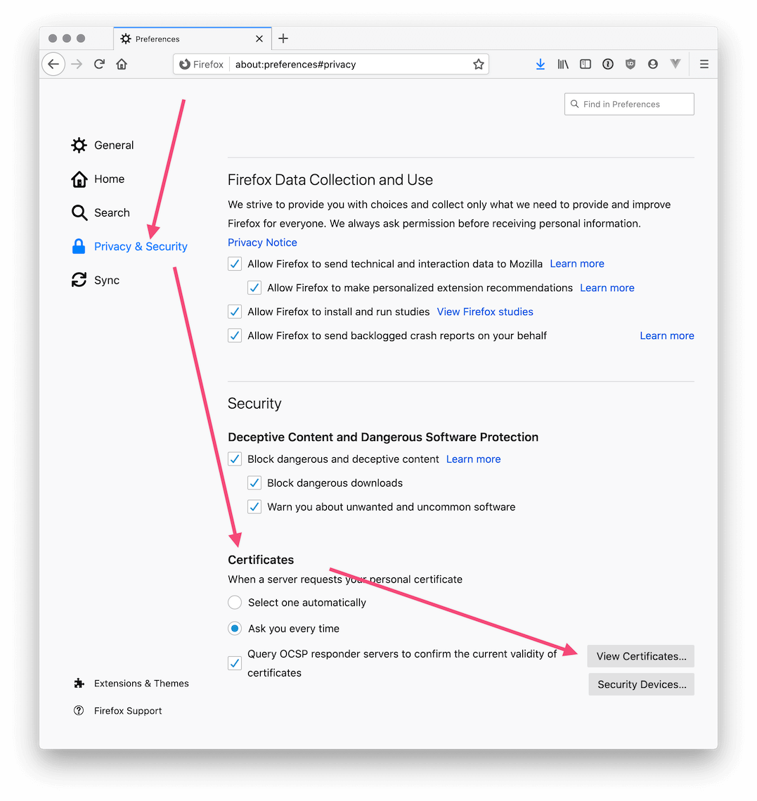
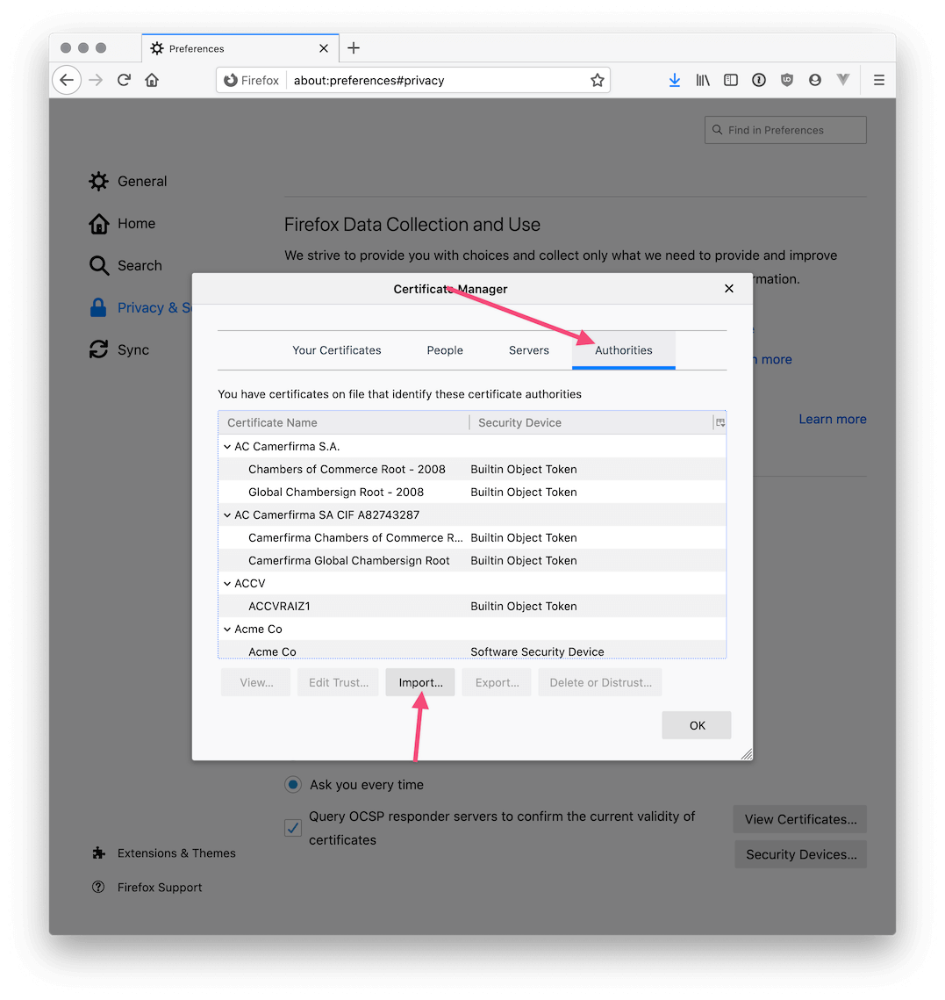

# Guide for Remal Docker Images 

## 1) Overview

## 3) Development environment
You can start the complete Docker stack on your machine if your machine has enough CPU and memory.

### 3.1) Prepare the environment
Perform the following tasks to prepare your environment to be ready to run the Remal Docker images.

#### 3.1.1) Install tools
* Install Git client.
* Install Docker and Docker-Compose.

#### 3.1.2) Prepare FQDN
Map hostnames to IP addresses in `/etc/hosts` file.
  * `127.0.0.1   am.hello.com`
  * `127.0.0.1   vault.hello.com`

#### 3.1.3) Prepare the environment for Forgerock Directory Server (LDAP)
The LDAP server has some special requirements.
Learn about how to prepare your environment to get it ready for Forgerock Directory Server, check [paragraph 3.1) of this document](infrastructure/forgerock-ds/README.md#31-preparation-of-your-environment).

### 3.2) Build the images
Each image has a build script that is called `build.sh`.
This script can be used to build the particular Docker image.
If you want to build the whole Remal Docker stack then it is recommended to use the `remal.sh` script because it simplifies the processes.
The benefit of using the main script are the followings:
* Not necessary to change between directories while building images.
* Multiple images can be built in one shot.
* The full image set can be built with one run.
* It builds slim images using the `BUILD_TYPE="slim"`  build argument.

The main build script can execute a task or multiple tasks.
For example, the following command builds all the necessary images that you need to have for development and then show the build info:
~~~
$ ./remal.sh abcdi
~~~

Before to use the script, do not forget to set the `REMAL_HOME` environment variable properly. It must point to the root directory of this project.
The default value of the variable is set to the directory from where you are executing the build script.

### 3.3) Start the development environment
Once the build is done you can start the servers locally and show the application logs by using the same script:
~~~
s remal.sh s
~~~

### 3.4) Setting Up Certificate Authorities (CA) in Firefox 
How to get Firefox to trust all self-signed certificates you use locally to serve your development sites over https and not complain about them?
You can add the root CA to your web browser.
The root CA locates in the CA server, the Docker container name is `pki.remal.com`.

### 3.5) Stop the development environment
Docker can back up the current configuration of the running servers before the whole environment will be stopped.
By default, the `docker compose stop` command attempts to stop a container by sending a `SIGTERM` to the running containers.
Then, it waits for a default timeout of 10 seconds. After the timeout, a `SIGKILL` is sent to the containers to forcefully kill it.
The backup processes usually need more time than 10 seconds to finish the backup, so we need to give more time to Docker than the default otherwise the shutdown-hooks will not work able to complete backup tasks.

~~~
$ docker-compose stop --timeout 120
~~~

## 5) License and Copyright
Copyright (c) 2020-2025 Remal Software, Arnold Somogyi. All rights reserved.

## 2) Annex 1) Image versioning
Subsequent releases of the same image must be assigned numerical identifiers consisting of three numbers separated by periods.

The versioning of the Remal Docker images is the following: `remal-<image>:x:y:z`

* The first number, called the major number, is increased when there are significant improvements or changes in functionality.
* The second number, called the minor number, is incremented when there are minor feature changes or notable fixes. For example, `remal-openjdk-11:0.2.0` indicates that minor changes were made to the earlier version, `remal-openjdk-11:0.1.0`.
* The third number, if it exists, is called the revision number and is added or increased when minor bugs are eliminated. The 7 in `remal-openjdk-11:0.2.7` shows that bug fixes were made to the previous version.

## Annex 1) Build slim Docker images
Does the Docker Image size matter?

You may think that image sizes are not relevant.
But if you think about the followings then you can realize that it really matters.
* Smaller Docker images take up less disk space.
* Reducing Docker image size cuts the cost of your Google/Amazon Cloud.
* A large Docker image is difficult (takes a lot of time) to upload.

We build as slim images as possible and remove image layers that contains unused data like installation files.
However, removing image layers is not easy because once a file has been copied to the image using the `COPY` Docker command, it can not be removed from the layer despite you delete it later during the build.
That happens because the `COPY` command automatically adds a new layer.
The only way to keep out install packages from the image is not using the `COPY` command.
We can avoid it by downloading the files during the image from a webserver and deleted them after the usage in the same layer.

So for building slim images you need to make the installation files downloadable.
Thus, you need to set up a local web server before the build and make all files available via `HTTP`.
The Remal slim image build process will download the files on-the-fly from your local web server using `wget` during the build instead of using the `COPY` command.

**Steps for the slim image build:**
1. Download [Apache-Tomcat](https://tomcat.apache.org/download-10.cgi) and start it using `bin/catalina.sh run`.
2. Create the following directory structure: `$CATALINA_HOME/webapps/docker-build`.
3. Copy the files and install packages from the `bin/` folder of each image source code into the web server directory.
4. Then start the build using the `slim` parameter, for example `./remal.sh ab`

## Annex 2) `init` and `startup` script naming convention
The files under the `init` and `startup` directories must be unique and the filenames must start with a number prefix, for example `010_start-tomcat.sh`
The prefix determines the execution order of the scripts.
If the filenames are not unique then during the Docker image build the files can be overridden accidentally.

There are four different kind of Remal images:
* `Base` image: used as a parent image, contains common functions and tools
* `Core`: Runtime environments like Java
* `Infrastructure`: servers like Active Directory, Tomcat, Database
* `Application`: application and REST services

File prefix ranges:

| image type     | range       |
|----------------|-------------|
| Application    | 7000 - 7999 |
| Monitoring     | 4000 - 4999 |
| Infrastructure | 3000 - 3999 |
| Core           | 2000 - 2999 |
| Base           | 1000 - 1999 |

Images and its types:

| image                   | type           | range         |
|-------------------------|----------------|---------------|
| java-21-postgres-runner | Application    | 70200 - 70299 |
| java-21-runner          | Application    | 70100 - 70199 |
| grafana                 | Monitoring     | 40200 - 40299 |
| prometheus              | Monitoring     | 40100 - 40199 |
| hcp-consul              | Infrastructure | 30600 - 30699 |
| hcp-vault               | Infrastructure | 30500 - 30599 |
| forgerock-am            | Infrastructure | 30400 - 30499 |
| forgerock-ds            | Infrastructure | 30300 - 30399 |
| tomcat-9                | Infrastructure | 30200 - 30299 |
| easy-rsa-pki            | Infrastructure | 30100 - 30199 |
| openjdk-21              | Core           | 20300 - 20399 |
| openjdk-17              | Core           | 20200 - 20299 |
| openjdk-11              | Core           | 20100 - 20199 |
| base                    | Base           | 10000 - 19999 |

## Annex 3) Troubleshooting
**SSH**
* Get rid of the `REMOTE HOST IDENTIFICATION HAS CHANGED` warning that appears while connecting to a container using SSH.
  
  Disable SSH localhost checking specifically for localhost by setting `NoHostAuthenticationForLocalhost` to `yes` in your `~/.ssh/config` as follows:
  ~~~
  NoHostAuthenticationForLocalhost yes
  ~~~

* Connect to a container Docker network and run a command:
  ~~~
  sshpass -p password ssh -oStrictHostKeyChecking=no root@pki.remal.com "ls -all"
  ~~~

**Network**
* List of the opened port
  * Connect to the container with SSH and install nmap: `apk add nmap` or `yum install nmap`
  * Run the port-scan with `nmap -p- <host>`, e.g. `nmap ds.remal.com`

**PKI**
* Lists entries in a keystore: `keytool -list -v -keystore <keystore-file> -storepass <changeit>`
* Test HTTPS connection: `curl https://user-service.hello.com:8443/actuator/health`
* How to check Subject Alternative Names for an SSL/TLS certificate?
  ~~~
  $ apk add openssl
  $ openssl s_client -connect website.example:443 </dev/null | openssl x509 -noout -text

  # or
  $ openssl s_client -connect website.example:443 </dev/null | openssl x509 -noout -ext subjectAltName
  ~~~

**BusyBox**

* Replace `wget` and `curl` with GNU version
  * `apk --no-cache add curl`
  * `apk --no-cache add wget`

**Run JAR in the container**
  * `kill -9 $(pidof java) && /docker.startup/40151_run-jars.sh`

## Annex 4) Useful bash aliases
~~~
alias li="docker image ls | (sed -u 1q; sort -n -k1)"
alias lir='docker image ls *remal* | sort'
alias lc="docker container ls -a"
alias cs='docker container stop $(docker container ls -a -q)'
alias rmc='if [[ $(docker container ls -a -q) ]]; then docker rm --force $(docker container ls -a -q); else printf "there is no container to remove\n"; fi'
alias rmi='docker volume rm $(docker volume ls -qf dangling=true) ; docker rmi $(docker image ls -qf dangling=true)'
~~~

## Annex 5) Docker commands
* Deploying a broken image:
  ~~~
  $ docker run -p 8022:22 --name <id> <image-name>:<version> tail -f /dev/null
  $ docker exec -it <id> /bin/bash
  ~~~

* Start an exited container:
  1. Find your stopped container id
     ~~~
     $ docker ps -a
     ~~~
  2. Commit the stopped container (this command saves modified container state into a new image):
     ~~~
     $ docker commit <CONTAINER-ID> test_image
     ~~~
  3. Start it with a different entry point:
     ~~~
     $ docker run -it --entrypoint=/bin/sh test_image
     ~~~

* Connect to a container using SSH:
  ~~~
  $ ssh -p <ssh-port> root@localhost
  ~~~
  Use `password` as a password.
  
  Example: `sshpass -p password ssh -oStrictHostKeyChecking=no root@vault.hello.com -p 13042`

