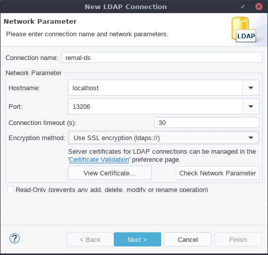
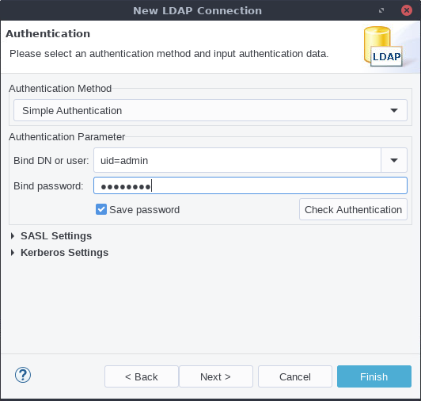
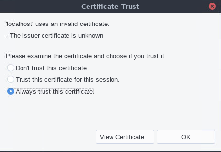

# Remal Image: ForgeRock Directory Server

### 1) Overview
This is a Remal Docker image for ForgeRock Directory Server, using [openjdk-17](../../tomcat/openjdk-17/README.md) as a base image.

### 2) Ports used by the image

| container port | description            |
|----------------|------------------------|
| 22             | SSH                    |
| 389            | LDAP                   |
| 636            | LDAP over SSL (LDAPS)  |
| 4444           | admin connector port   |

Directory Server admin user:
* admin DN: `uid=admin`
* password: `password`

## 3) Working with the Docker container
### 3.1) Preparation of your environment
#### 3.1.1) Set the maximum file descriptors and processes
Before you start the container you need to set the maximum file descriptors and processes on the _host machine_ where the Docker container will run.
Each DS instance in your environment should have access to at least 65,536 file descriptors to handle multiple client connections.
It may also be necessary to increase the number of processes available to the user running the DS processes.

That is important because the `ulimit` settings of the host machine apply to the docker container.
It is regarded as a security risk that programs running in a container can change the ulimit settings for the host.

Set the limits properly on your Docker host machine:

1. Stop the docker demon: `sudo service docker stop`
2. Change the `ulimit` settings on the host (`/etc/security/limits.conf`).
3. Start the docker demon. It now has your revised limits, and its child processes as well.
4. Run `ulimit -a` in the host machine and then in the container to confirm the open files limit has been inherited.

#### 3.1.2) Set file notification
A directory server backend database monitors file events.
On Linux systems, backend databases use the inotify API for this purpose.
The kernel tunable `fs.inotify.max_user_watches` indicates the maximum number of files a user can watch with the inotify API.

Make sure this tunable is set to at least 512K:
~~~
$ sysctl fs.inotify.max_user_watches

fs.inotify.max_user_watches = 524288
~~~
If this tunable is set lower than that, update the `/etc/sysctl.conf` file to change the setting permanently, and use the `sysctl -p` command to reload the settings:
~~~
$ echo fs.inotify.max_user_watches=524288 | sudo tee -a /etc/sysctl.conf
[sudo] password for admin:

$ sudo sysctl -p
fs.inotify.max_user_watches = 524288
~~~

### 3.2) Deploying the container
  ~~~
  $ ./start.sh
  ~~~

### 3.3) Backup and restore the configuration files and the LDAP data
* **Backup:**
  * Set up a volume that points to the `/opt/opendj/backup` directory in the container.
  * The backup process will create the backup files into this directory.
  * Then set the `CONFIG_BACKUP` and/or `LDAP_BACKUP` variables to `true`.
  * This setting instructs the container to execute the backup task before the container stops completely.
  * The default timeout before Docker kills completely the container is 10 seconds.
    If the backup process runs longer, then you need to increase the Docker's shutdown timeout accordingly.

    | Name, shorthand | Default | Description                                | Example                           |
    |-----------------|---------|--------------------------------------------|-----------------------------------|
    | --time , -t     |  10     | Seconds to wait for stop before killing it | `docker stop -t 60 <containerId>` |

  Start the container:
  ~~~
  $ docker run \
      ...
      --env CONFIG_BACKUP=true \
      --env LDAP_BACKUP=true \
      --volume "$HOME/dev/workspace/java/remal/gombi/docker/forgerock/forgerock-ds/backup:/opt/opendj/backup" \
  ~~~
  Stop the container:
  ~~~
  $ docker stop --time 60 ds.remal.com
  ~~~

    * **Restore:**
      * To restore the server's configuration files and/or the LDAP database, mount a volume that points to the `/opt/opendj/backup` directory in the container and copy the backup files to the mounted directory on the host machine.
      * Set the name of the backup files using the `CONFIG_RESTORE_FROM` and/or `LDAP_RESTORE_FROM` environment variables.

      ~~~
      $ docker run \
          ...
          --env CONFIG_RESTORE_FROM=forgerock-ds-conf-2023-01-18_11.48.34.tar.gz \
          --env LDAP_RESTORE_FROM=forgerock-ds-ldap-2023-01-18_11.48.34.tar.gz \
          --volume "$HOME/dev/workspace/java/remal/gombi/docker/forgerock/forgerock-ds/backup:/opt/opendj/backup" \
      ~~~

## 4) Explore the LDAP
You can use the [Apache Directory Studio™](https://directory.apache.org/studio) Eclipse-based LDAP browser and directory client to manage the data of your LDAP server.

Configuration of a new LDAP connection:

## 5) License and Copyright
Copyright (c) 2020-2024 Remal Software, Arnold Somogyi. All rights reserved.
