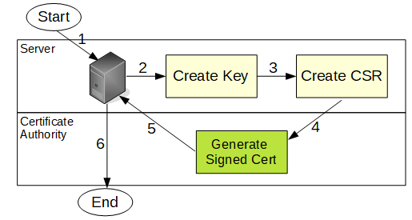
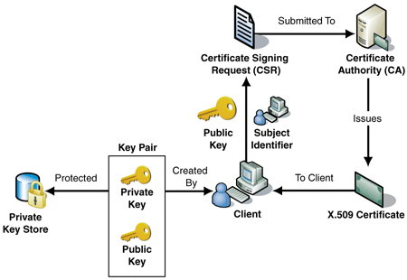

# Remal Image: Private Certificate Authority Server

## 1) Overview
Certificate Authority (CA) is an entity responsible for issuing digital certificates to make communication secure.
Its acts as a trusted third party to the owner of the certificate and the party relying upon the certificate.
The Certificate Authority entity could be either public or private.
Public CAs are commonly used to verify the identity of websites and private CAs are used for generating certificates for a Client-to-Site VPN, users, internal servers, or individual programs and services within your infrastructure such as local web servers.
In this Docker image, we create a private certificate authority (CA) using `easy-rsa` CLI utility to build and manage the CA Server.

A real certificate signed by a CA (Certificate Authority) is expensive and a pain to procure and install.
The best alternative is to create your own "internal" CA, and have that CA sign certificates for your services.
In most cases, this is going to work fine for internal services that do not need to be trusted by a browser.

You might ask why is this better than just using self-signed certificates?
The idea is that you can import your CA certificate once into the truststore for your various clients, and thereafter those clients will trust any certificate presented that is signed by your CA.
For example, assume I have LDAP servers: `server-1`, `server-2` and `server-3`.
Using only self-signed certificates, you will need to import the certs for each server (three in this case) into your client's truststore.
If instead, you use a CA, you need only import a single CA certificate.
The LDAP server certificates will be trusted because they are signed by your CA.
Once you start to get a lot of services deployed using self-signed certificates becomes super painful.
Hopefully, that all makes sense.

Generate a Server Certificate for your server, i.e. Tomcat, Spring Boot, etc.:
1. Create your own Certificate Authority
2. Create a `Certificate Signing Request` from your server (CSR)
3. Have CA sign your server’s cert request

This diagram illustrates the general steps involved in a server obtaining a signed certificate from a Certificate Authority.

1. Setup you SSL config file or Private-CA environment
2. Create your own CA
3. Create a cert request from your server
4. Have CA sign your server’s cert request

The next illustration shows generating a certificate using a private and a public key pair.

You sign the certificate with the root certificate of a Certificate Authority (providing the public key through a certificate signing request .csr). Then you issue and export the signed certificate.

When issuing a self-signed certificate, follow these steps:
1. Create a Certificate Signing Request (CSR).

   You need to issue a Certificate Signing Request before issuing a final certificate, while creating both a private key and a public key file.

2. Sign the request.

   To sign the request, you need a Certificate Authority (CA), it is best to use one that you already have for your organization.

3. Export the private and public key under a P12 format.

   Finally, you need a P12 file holding both the private and the public key.

## 2) Image details
During the image build a new private CA key and certificate will be generated.
Locations:
* Certificate (public key): `$EASYRSA_HOME/pki/ca.crt`
* Private key: `EASYRSA_HOME/pki/private/ca.key`

Details:
* based on the latest `alpine` image
* `bash` and `sh`, bash is the default
* customized bash prompt that shows the container name and version
* bash aliases: `ll` and `ls`
* `ssh` running on port 22
* password of the `root` user is set to `password`
* installed and configured `easy-rsa`
* `head.sh` and `tail.sh` bash scripts that can be used in the child containers to execute custom commands
* `shutdown-actions.sh` bash script that is executed automatically before the container shuts down

## 3) Ports used by the image

| container port | description |
|----------------|-------------|
| 22             | SSH         |

## 4) Generate a server certificate
Login to the container with `ssh -p 13022 root@localhost` and then use the `generate-cert.sh` script that generates you server CA signed server certificate.

Usage: `generate-cert.sh domain [keystore-home]`

where
* `domain`: the host or domain name of the server for what the certificate will be generated
* `keystore-home`: the path of the certificate on the remote host where the certificate will be copied, optional parameter

If the `keystore-home` is not set then the new server certificate will not be copied to the remote host, but it is available under the `/pki` directory of this machine.

Example:
~~~
$ $EASYRSA_HOME/generate-cert.sh tomcat /tmp
~~~

## 5) Certificate info
~~~
$ openssl x509 -text -noout -in /opt/easy-rsa/pki/private/consul.hello.com.p12
$ openssl ec -text -noout -in dc1-client-consul-key.pem 
~~~

## 6) License and Copyright
Copyright (c) 2020-2023 Remal Software, Arnold Somogyi. All rights reserved.

